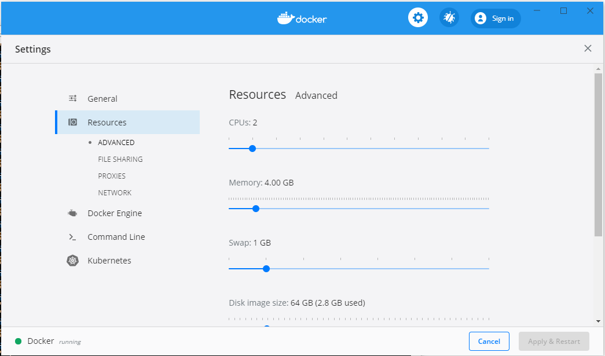
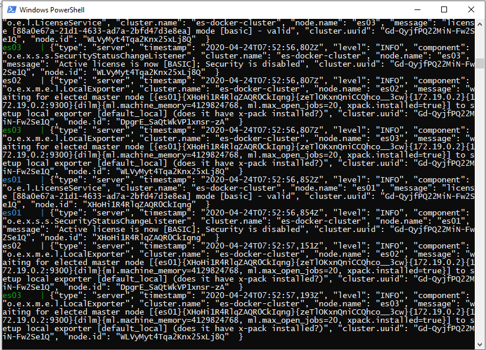
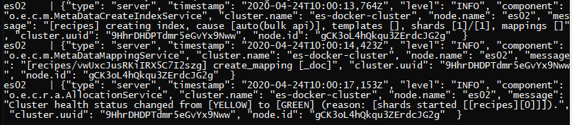

# Running elasticsearch from docker

## Needed installations on computer:

- Docker/ docker for windows
- Npm
- Node.js

## First Time setup:

- Start docker/docker for windows

- For windows: Make sure docker engine has at least 4GB of memory, otherwise you cannot create a cluster with 3 nodes (and you get a weird error, see: https://github.com/elastic/elasticsearch/issues/51196). Click to docker icon in the toolbar > go to Settings > Resources > Advanced > set memory to 4.00GB > Apply & Restart.



- Run `docker-compose up` from a command line tool in the folder that contains the docker-compose.yml file. This creates an elasticsearch cluster with 3 nodes. The volumes are bound so data will be preserved. This may take a few minutes and you will so a lot of logging in the console.

> “Compose preserves all volumes used by your services. When docker-compose up runs, if it finds any containers from previous runs, it copies the volumes from the old container to the new container. This process ensures that any data you’ve created in volumes isn’t lost.” - https://docs.docker.com/compose/

This does a whole bunch of logging in the console, when finished should look something like this:



Leave this window open and open a new window for next steps.

- Check if elasticsearch is running correctly in postman by doing a GET request on http://localhost:9200/_cat/nodes?v (or http://localhost:9200/_nodes for a more in depth information). This will return a list of all the known nodes that should have all three es0X nodes like below (master node might change in your configuration):

```
ip         heap.percent ram.percent cpu load_1m load_5m load_15m node.role master name
172.18.0.3           19          92  39    0.89    0.29     0.11 dilm      -      es01
172.18.0.2           19          92  39    0.89    0.29     0.11 dilm      *      es02
172.18.0.4           28          92  48    0.89    0.29     0.11 dilm      -      es03
```

### load recipes data

- Run `npm install elasticsearch` in the folder where the load_recipes.js script is located (elasticsearch-docker folder). (Script adapted from: https://www.sitepoint.com/building-recipe-search-site-angular-elasticsearch/).

- Unzip the recipeitems.zip and place the unzipped recipeitems.json in the same folder as load-recipes.js.

- Run the script to bulk load recipes by running `node load_recipes.js` in the command line. This script counts down the records until all are inserted and should show “Inserted all records!” when finished. The command line window where the elasticsearch docker is running should show something similar to this:



- To check if data is loaded correctly, do a GET request on: http://localhost:9200/_cat/indices?v (or http://localhost:9200/_starts for a more in depth information). The result should show that there is 1 primary and 1 replica for the recipes index. The health of this index should be green:

```
health status index   uuid                   pri rep docs.count docs.deleted store.size pri.store.size
green  open   recipes Qjo2EzBeRDKkZGBsnmaORg   1   1     173278            0    365.5mb        182.7mb
```

The elasticsearch cluster is now up and the recipes data is loaded!

## Ways of stopping the elasticsearch cluster

- Run `docker-compose stop` in the folder containing the docker-compose.yml file.
- Press ctrl+c in the window that is still running the docker container.
- Click on the stop icon in docker dashboard (if using docker for windows).

## Removing the cluster

Run `docker-compose down`. This does not remove the data. If you also want to remove all the data that was saved in elasticsearch, run: `docker-compose down -v`. This removes all the volumes specified in the yml file. You can check which docker containers (running and stopped) are on your computer by running `docker ps` (`docker container ls` to list only the ones that are running). To check which volumes are still on your computer run `docker volume ls`.

## Starting elasticsearch cluster after first setup:

Run `docker-compose up`. If you didn’t remove the volumes the data should still be there. If you did remove the volumes the data needs to be loaded again using the node load_recipes.js script. Any changes to the data you made yourself will be gone.
